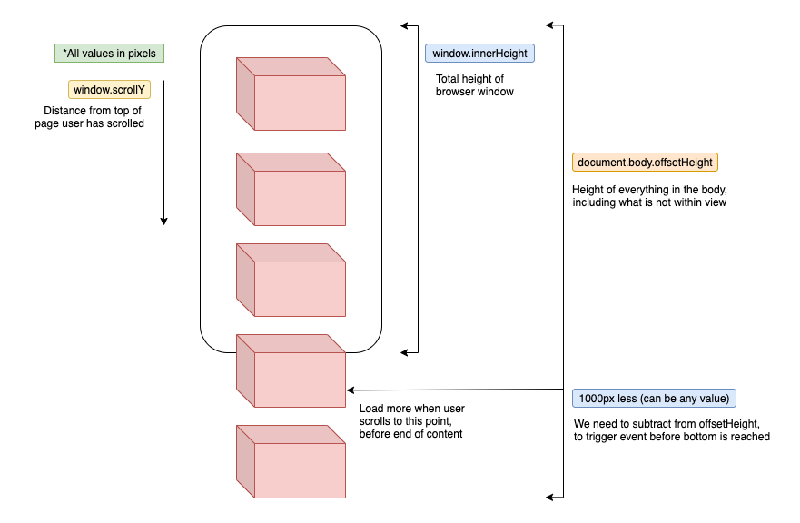
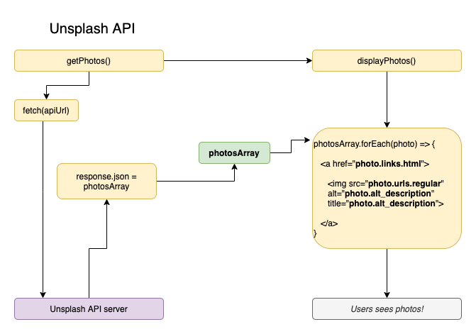

# Infinity Scroll Using Unsplash API
The Infinity Scroll website populates its images using the Free Unsplash API, which gives it a infinite scrolling experience similar to infinite scrolling in a social media app. 
The site uses an '*Async Fetch API method*' to fetch the data from the Unsplash Website. 

The max count of images you can fetch in a single request is 30, therefore to give it a infinite scroll we need to determine the point near the end of content so that it can fetch more images and give it a seemless look. 

This can be explained using the following diagram. 

&nbsp

&nbsp

Here we add an *scroll eventListener* on the window to listen to the scroll event and as soon we are about the reach the bottom the DOM is populated again. 
The Position at which we need to poplate again can be calculted by adding the '*window.scrollY*' and '*window.innerHeight*' and checking whether it is greater than or equal to the '*document.body.offsetHeight*' here we subtract 1000 from it so that the data can be loaded before it reaches the bottom and there is no delay in displaying the Images. 

The following shows the flowchart of the site. 

&nbsp

&nbsp

### Requirements:
* You require an API key from the Unsplash website which you can replace with the placeholder in **key.js** file  (Rename the key_file_template.js to key.js or copy the code from it to a new key.js file).
* Replace the Placeholder **Your_API_Key** with the API from Unsplash in the key.js file.